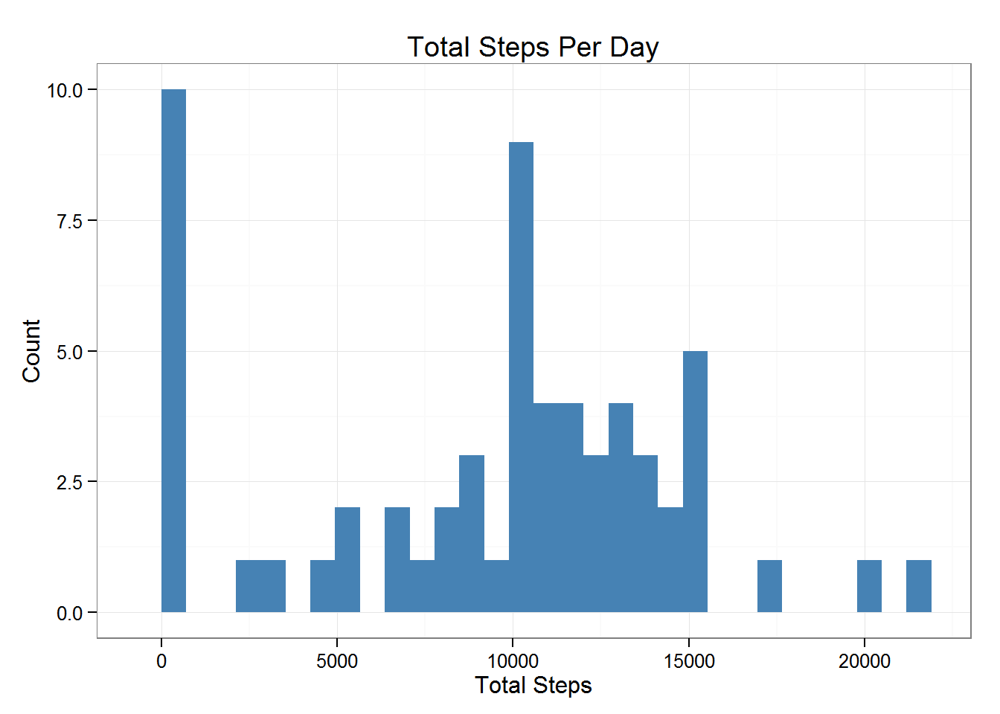
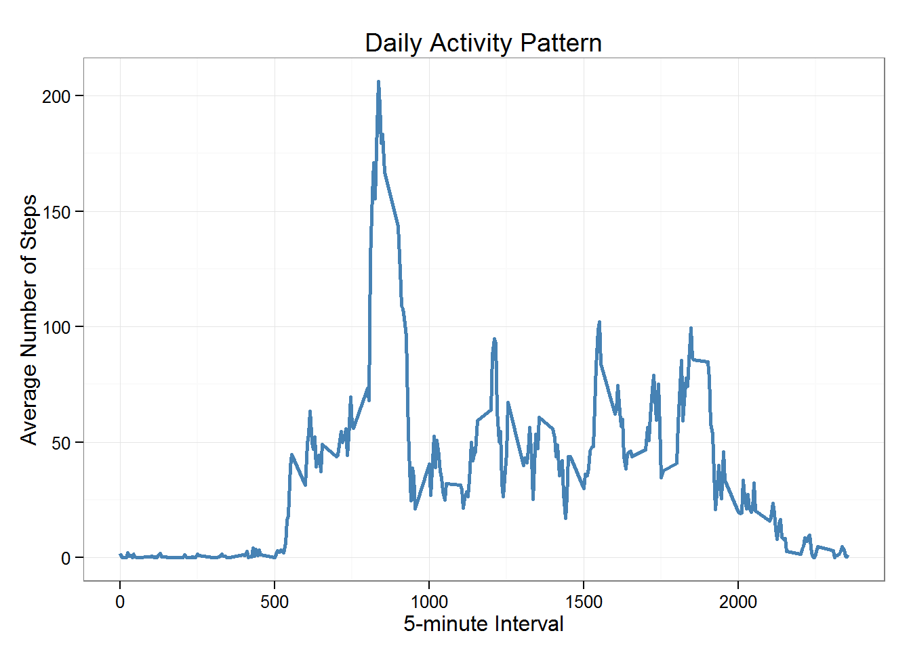
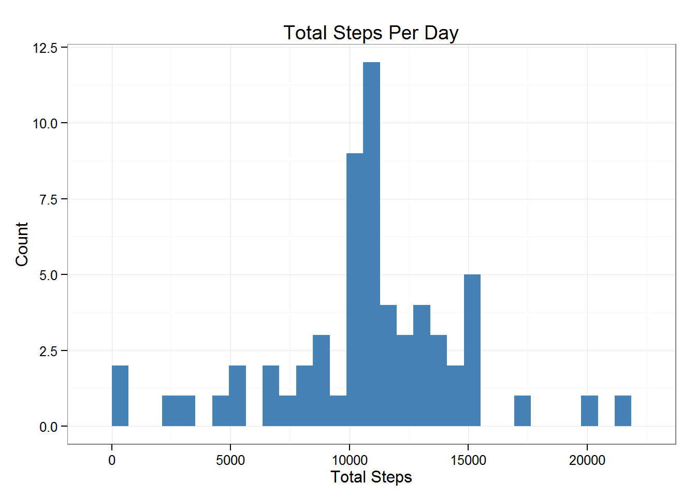
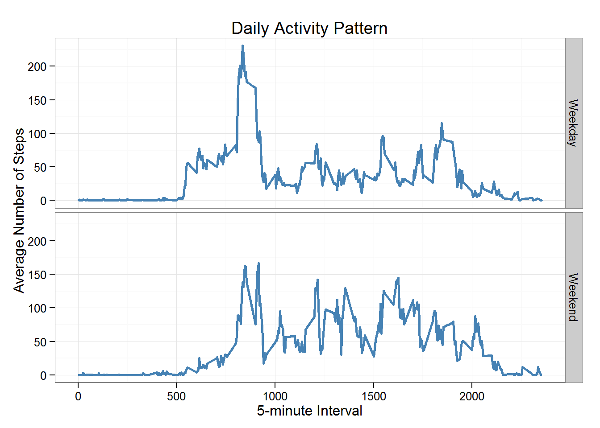

## Loading Required Dependencies

```r
library(dplyr)
library(ggplot2)
library(lubridate)
```

## Loading and preprocessing the data

Unzipping the data file, and reading the data.


```r
if(!file.exists('activity.csv')){
    unzip('activity.zip')
}
Activity <- read.csv("activity.csv", colClasses = c("numeric", "character", 
                                                    "numeric"))
```

Using dplyr and Lubridate packages to transform date column into date format.

```r
Activity <- Activity %>% rowwise() %>% mutate(date = ymd(date))
```


## What is mean total number of steps taken per day?
Calculating the total steps per day

```r
StepsPerDay <- Activity %>% group_by(date) %>% 
        summarise(TotalSteps = sum(steps, na.rm = TRUE))
head(StepsPerDay)
```

```
## Source: local data frame [6 x 2]
## 
##         date TotalSteps
##       (time)      (dbl)
## 1 2012-10-01          0
## 2 2012-10-02        126
## 3 2012-10-03      11352
## 4 2012-10-04      12116
## 5 2012-10-05      13294
## 6 2012-10-06      15420
```

Plotting a histogram of steps per day

```r
a <- ggplot(StepsPerDay, aes(TotalSteps))
a + geom_histogram(fill = "steelblue") +
        ggtitle("Total Steps Per Day") +
        xlab("Total Steps") + 
        ylab("Count") +
        theme_bw()
```

 

Calculating the mean and the median of total steps per day

```r
mean(StepsPerDay$TotalSteps)
```

```
## [1] 9354.23
```

```r
median(StepsPerDay$TotalSteps)
```

```
## [1] 10395
```

From the above calculation, the mean is: 9354.23.  
While the median is: 10395.  


## What is the average daily activity pattern?

Calculating average steps per 5-minute interval across all days.

```r
AverageStepsPerInterval <- Activity %>% group_by(interval) %>% 
        summarise(AverageSteps = mean(steps, na.rm = TRUE))
head(AverageStepsPerInterval)
```

```
## Source: local data frame [6 x 2]
## 
##   interval AverageSteps
##      (dbl)        (dbl)
## 1        0    1.7169811
## 2        5    0.3396226
## 3       10    0.1320755
## 4       15    0.1509434
## 5       20    0.0754717
## 6       25    2.0943396
```

Creating a time series plot.

```r
a <- ggplot(AverageStepsPerInterval, aes(x=interval,y=AverageSteps))
a + geom_line(color = "steelblue", size = 1) + 
        ggtitle("Daily Activity Pattern") + 
        xlab("5-minute Interval") + 
        ylab("Average Number of Steps") +
        theme_bw()
```

 

Finding The 5-minute interval with the maximum average number of steps.

```r
# Finding the index of the interval
IntervalIndex <- which.max(AverageStepsPerInterval$AverageSteps)
# Finding the value of the interval
IntervalValue <- AverageStepsPerInterval$interval[IntervalIndex]
```

We find that the 5-minute interval with the maximum average number of steps is:
835

## Imputing missing values

Calculating the number of missing values in the dataset

```r
SumNa <- sum(is.na(Activity))
```
The number of rows with missing values is: 2304

The strategy is to impute the steps missing values with the average steps of the correspnding 5-minute interval.

The following code, uses the dplyr package, and makes use of the previously computed "Average Steps Per Interval",
to create an imputed dataset.

```r
ImputedActivity <- Activity %>% 
        mutate(steps = ifelse(
                is.na(steps),
                unlist(AverageStepsPerInterval[which(AverageStepsPerInterval$interval == interval),2]),
                steps))
```
As we see there was a bunch of missing values at the beginning of our activity dataset:

```r
head(Activity)
```

```
## Source: local data frame [6 x 3]
## 
##   steps       date interval
##   (dbl)     (time)    (dbl)
## 1    NA 2012-10-01        0
## 2    NA 2012-10-01        5
## 3    NA 2012-10-01       10
## 4    NA 2012-10-01       15
## 5    NA 2012-10-01       20
## 6    NA 2012-10-01       25
```
Which are not imputed with the correct averages:

```r
# Compare the values of the averages of the 5-minute intervals
head(AverageStepsPerInterval)
```

```
## Source: local data frame [6 x 2]
## 
##   interval AverageSteps
##      (dbl)        (dbl)
## 1        0    1.7169811
## 2        5    0.3396226
## 3       10    0.1320755
## 4       15    0.1509434
## 5       20    0.0754717
## 6       25    2.0943396
```

```r
# To the value of the same 5-minute intervals in the imputed dataset
head(ImputedActivity)
```

```
## Source: local data frame [6 x 3]
## 
##       steps       date interval
##       (dbl)     (time)    (dbl)
## 1 1.7169811 2012-10-01        0
## 2 0.3396226 2012-10-01        5
## 3 0.1320755 2012-10-01       10
## 4 0.1509434 2012-10-01       15
## 5 0.0754717 2012-10-01       20
## 6 2.0943396 2012-10-01       25
```
Now we'll re-create the total steps per day histogram.

```r
ImputedStepsPerDay <- ImputedActivity %>% group_by(date) %>% 
        summarise(TotalSteps = sum(steps, na.rm = TRUE))
a <- ggplot(ImputedStepsPerDay, aes(TotalSteps))
a + geom_histogram(fill = "steelblue") +
        ggtitle("Total Steps Per Day") +
        xlab("Total Steps") + 
        ylab("Count") +
        theme_bw()
```

 

The mean and median of the imputed total steps is:

```r
mean(ImputedStepsPerDay$TotalSteps)
```

```
## [1] 10766.19
```

```r
median(ImputedStepsPerDay$TotalSteps)
```

```
## [1] 10766.19
```

We notice that the mean and median are now the same after imputing.
The median did not change, and there is a little increase to the mean.

## Are there differences in activity patterns between weekdays and weekends?
For this part of the analysis, we will use the imputed dataset.  
We will first add a column for the week day names (DayName) corresponding to the dates. 
Then we will create a factor variable column (DayType), identifying weekdays and weekends.  

```r
ImputedActivity <- ImputedActivity %>%
        mutate(DayName = weekdays(date)) %>%
        mutate(DayType = ifelse(
                DayName %in% c('Saturday','Sunday'),
                'Weekend',
                'Weekday'
        ))
ImputedActivity$DayType <- factor(ImputedActivity$DayType)
# Now we can see the final dataset.
head(ImputedActivity)
```

```
## Source: local data frame [6 x 5]
## 
##       steps       date interval DayName DayType
##       (dbl)     (time)    (dbl)   (chr)  (fctr)
## 1 1.7169811 2012-10-01        0  Monday Weekday
## 2 0.3396226 2012-10-01        5  Monday Weekday
## 3 0.1320755 2012-10-01       10  Monday Weekday
## 4 0.1509434 2012-10-01       15  Monday Weekday
## 5 0.0754717 2012-10-01       20  Monday Weekday
## 6 2.0943396 2012-10-01       25  Monday Weekday
```

```r
# And we can see how many days are weekdays or weekends.
table(ImputedActivity$DayType)
```

```
## 
## Weekday Weekend 
##   12960    4608
```

Calculating the average steps per interval per weekday or weekend.  

```r
AverageStepsPerIntervalPerDayType <- ImputedActivity %>% group_by(interval,DayType) %>% 
        summarise(AverageSteps = mean(steps, na.rm = TRUE))
```

```
## Warning: Grouping rowwise data frame strips rowwise nature
```

```r
head(AverageStepsPerIntervalPerDayType)
```

```
## Source: local data frame [6 x 3]
## Groups: interval [3]
## 
##   interval DayType AverageSteps
##      (dbl)  (fctr)        (dbl)
## 1        0 Weekday   2.25115304
## 2        0 Weekend   0.21462264
## 3        5 Weekday   0.44528302
## 4        5 Weekend   0.04245283
## 5       10 Weekday   0.17316562
## 6       10 Weekend   0.01650943
```

Creating a time series plot of the average steps per interval for both types of days.

```r
a <- ggplot(AverageStepsPerIntervalPerDayType, aes(interval, AverageSteps))
a + geom_line(color = "steelblue", size = 1) + 
        facet_grid(DayType ~ .) + 
        ggtitle("Daily Activity Pattern") +
        xlab("5-minute Interval") + 
        ylab("Average Number of Steps") +
        theme_bw()
```

 

We notice from the above plot, that steps are much less in the start of the weekend day, 
compared to the start of a weekday.
